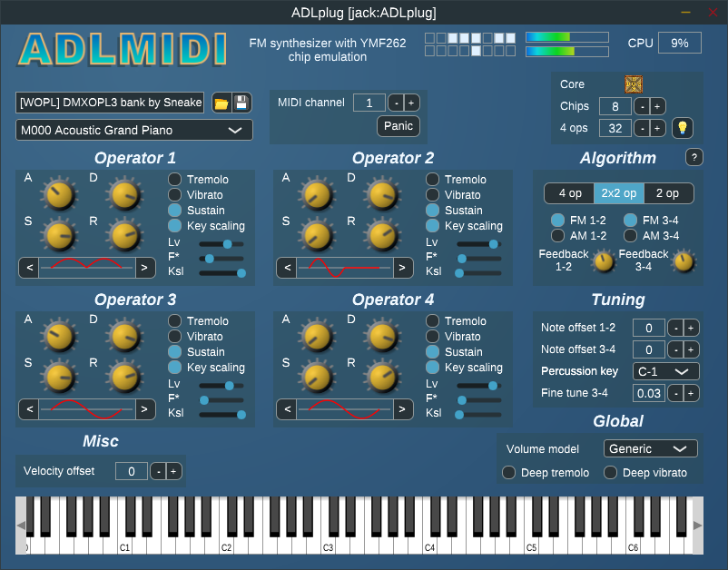

# ADLplug
Synthesizer plugin for ADLMIDI and OPNMIDI (VST/LV2)



## Introduction

This software package provides FM synthesizer plugins, based on [OPL3](https://en.wikipedia.org/wiki/Yamaha_YMF262) and [OPN2](https://en.wikipedia.org/wiki/Yamaha_YM2612) sound chip emulations.  
The emulations and the drivers are provided by [libADLMIDI](https://github.com/Wohlstand/libADLMIDI) and [libOPNMIDI](https://github.com/Wohlstand/libOPNMIDI).

- [x] control of multiple YMF262/YM2612 emulated chips
- [x] high fidelity emulation, with choice of compromise level (good fidelity/fast, excellent fidelity/slow)
- [x] synthesis of melodic and percussive instruments
- [x] extensible polyphony
- [x] bundled collection of instruments
- [x] support for dynamic parameterization and automation
- [x] rigorous implementation of the MIDI standard
- [x] multi-channel operation with General MIDI compatibility
- [x] ability to synthesize entire MIDI files out of the box

Author: [Jean Pierre Cimalando](https://github.com/jpcima)  
Contributors: [Olivier Humbert](https://github.com/trebmuh), [Christopher Arndt](https://github.com/SpotlightKid), [Bruce Sutherland](https://github.com/bsutherland), [David Runge](https://github.com/dvzrv), [Jérémy Frey](https://github.com/jfrey-xx)

## Development builds

[](https://ci.appveyor.com/project/jpcima/ADLplug)

You can find automatic builds of the development branch [here](https://github.com/jpcima/ADLplug/releases/tag/latest).

## Useful links

- User Manual : [English :us:](http://jpcima.sdf1.org/software/documentation/ADLplug/manual/en/manual.html) [French :fr:](http://jpcima.sdf1.org/software/documentation/ADLplug/manual/fr/manual.html)
- LibraZiK-2 : [ADLplug :fr:](https://librazik.tuxfamily.org/doc2/logiciels/adlplug) [OPNplug :fr:](https://librazik.tuxfamily.org/doc2/logiciels/opnplug)
- Fedora Copr : [ycollet/linuxmao](https://copr.fedorainfracloud.org/coprs/ycollet/linuxmao/)
- Arch Linux AUR : [adlplug-git](https://aur.archlinux.org/packages/adlplug-git/) and [opnplug-git](https://aur.archlinux.org/packages/opnplug-git/)
- Bank editor software : [OPL3](https://github.com/Wohlstand/OPL3BankEditor) and [OPN2](https://github.com/Wohlstand/OPN2BankEditor)

## FM core characteristics

| Core      | Chip | Accuracy | Speed  | Rhythm-mode channels | Extended panning |
|-----------|------|----------|--------|----------------------|------------------|
| DOSBox    | OPL3 | ★★★★★    | ★★★★★  | ★★                   | ★                |
| Nuked 1.8 | OPL3 | ★★★★★ +  | ★☆☆☆☆  | ★★                   | ★                |
| Nuked 1.7 | OPL3 | ★★★★★ +  | ★★★☆☆  | ★★                   | ★                |
| Opal      | OPL3 | ★★★★☆    | ★★★☆☆  | ☆☆                   | ★                |
| Java      | OPL3 | ★★★★☆    | ☆☆☆☆☆  | ★☆                   | ★                |

| Core                | Chip | Accuracy | Speed  | SSG-EG   | Extended panning |
|---------------------|------|----------|--------|----------|------------------|
| MAME                | OPN2 | ★★★★★    | ★★★★☆  | ★★★★☆    | ★                |
| Nuked               | OPN2 | ★★★★★ +  | ☆☆☆☆☆  | ★★★★★    | ★                |
| Gens                | OPN2 | ★★★☆☆    | ★★★★☆  | ★☆☆☆☆    | ★                |
| Neko Project II Kai | OPNA | ★★★★☆    | ★★★☆☆  | ★????    | ★                |
| MAME FM             | OPNA | ★★★★★    | ★★★☆☆  | ★????    | ★                |

## Build instructions

Install required dependencies:
- the CMake build system
- a C++11 compiler
- development packages for Linux: Jack, ALSA, Freetype, X11

### Compiling

```
git clone --recursive https://github.com/jpcima/ADLplug.git
mkdir ADLplug/build
cd ADLplug/build
cmake -DCMAKE_BUILD_TYPE=Release ..  #<more build options...>
cmake --build .
```

This package is able to build several plugins from a single source:
- to build the OPL3 variant, define the option `ADLplug_CHIP` to `OPL3`;
- to build the OPN2 variant, define the option `ADLplug_CHIP` to `OPN2`.

| Build option                                  | Description                                                     |
| --------------------------------------------- | --------------------------------------------------------------- |
| -DADLplug_VST2=ON/OFF                         | Build a VST2 plugin                                             |
| -DADLplug_VST3=ON/OFF                         | Build a VST3 plugin                                             |
| -DADLplug_LV2=ON/OFF                          | Build a LV2 plugin                                              |
| -DADLplug_Standalone=ON/OFF                   | Build a standalone program                                      |
| -DADLplug_Jack=ON/OFF                         | Build a standalone program for Jack with better features        |
| -DADLplug_CHIP=OPL3/OPN2                      | Build a variant for the given chip type (default: OPL3)         |
| -DADLplug_PCH=ON/OFF                          | Use precompiled headers, on a compiler which supports it        |
| -DADLplug_ASSERTIONS=ON/OFF                   | Force building with assertions regardless of build type         |

### Installing

```
sudo cmake --build . --target install
```

### Change Log

**1.0.2**

- English translation of the user manual by Bruce Sutherland
- modified KSL editing behavior to make it linear with regards to attenuation
- added a build option to link with system-wide libfmt
- made the resource system compatible with unsigned-char targets

**1.0.1**

- updated XG bank by Wohlstand for OPN with new percussion instruments
- partial rework of the state handling mechanism
- initial version of Audio Unit; does not pass the validation yet

**1.0.0**

- added the Java OPL3 emulator by Robson Cozendey
- added the Opal OPL3 emulator from Reality Adlib Tracker
- fixed missing percussion in case the key is released very quickly
- allowed to play the full drum set on virtual keyboard
- prevented selection of percussive instruments on melodic channels and vice-versa
- permitted changing programs using the scroll wheel over the combo box
- limited the scroll wheel step to 1 for discrete controls
- displayed the exact value for knob and slider controls
- supported the rhythm-mode channels for bank files which use it
- performed more efficient channel management in case of many sustained notes
- fixed a rare fatal error in case hold pedal is used and channel pressure is high
- implemented a custom resource system for faster rebuilds
- changed the user interface in minor ways

**1.0.0.beta.5**

- added a new chip: YM2608 (OPNA) using Neko Project II Kai emulation
- added a new emulator: MAME YM2608
- allowed to choose a chip rate which matches either OPN2 or OPNA instruments
- allowed saving and restoring the program selection, part selection and bank name
- added Non session management capabilities `optional-gui`, `switch`
- hidden a large number of parameters to improve performance under hosts
- fixed incorrect handling of OPN levels on the graphical interface
- permitted a VST2 build using VeSTige as a replacement of Steinberg SDK
- added a CLI flag `--version` in the JACK standalone
- added a window icon in the JACK standalone
- built the macOS standalone as an app bundle

**1.0.0.beta.4**

- add a control for master volume
- support loading SBI instruments
- support the Non session manager
- fixed a case when the state loading fallback would fail because of a bad initialization sequence
- fixed the editor state after closing and reopening under certain hosts
- allow to reload a saved bank which has no melodic banks or no percussive banks
- add an ability to delete entire banks
- memorize the instrument directory between uses
- update the bank collection for OPN2

**1.0.0.beta.3**

- added the ability to add, delete and rename banks and programs
- support extended key maps with unicode characters
- fixed a crash at startup when the state is restored before setting up the synthesizer
- added soft panning support for OPN2
- fixed a case where parameters would not be synchronized after receiving MIDI program change

**1.0.0.beta.2**

- added the CLI flag `-a` for auto-connection to system outputs in the JACK-only standalone
- added the freedesktop shortcuts and icons
- support for keyboard mappings other than QWERTY
- support setting the keyboard's octave
- highlighted the keys played via MIDI input
- made the program selection follow MIDI program change events
- allowed to install into the GNU standard installation directories
- we have been selected for the [Open Source Music FM Synthesizer Challenge](https://fmchallenge.osamc.de/fmsynths/)! :tada:

**1.0.0.beta.1**

- support of OPN2 synthesis in a distinct plugin
- fixed the plugin state which would be saved incomplete
- fixed the extension of OPN2 bank files in the file chooser

**1.0.0.alpha.3**

- compensation of MIDI latency at high buffer sizes
- fixed a mismanagement of the 4-op channel map
- fixed cases of bad channel allocations following a long idle period
- improved internal timing precision
- gained an ability to save and restore the current state
- added a large collection of embedded banks
- enhanced the UI in various ways

## License

ADLplug consists of various parts distributed under different free software licenses.
The parts developed exclusively for this project are Boost licensed.
The other parts and respective licenses are indicated here below.

| Files                                      | License                                               |
| ------------------------------------------ | ----------------------------------------------------- |
| `thirdparty/fmt`                           | 3-Clause BSD                                          |
| `thirdparty/JUCE`                          | GNU GPL v3                                            |
| `thirdparty/libADLMIDI`                    | GNU LGPL v3, GNU LGPL v2.1, GNU GPL v3, Public Domain |
| `thirdparty/libOPNMIDI`                    | GNU LGPL v3, GNU LGPL v2.1, GNU GPL v3                |
| `thirdparty/simpleini`                     | MIT                                                   |
| `thirdparty/vst3sdk`                       | GNU GPL v3                                            |
| `thirdparty/nonlib`                        | ISC                                                   |
| `thirdparty/wopl`                          | GNU LGPL v3                                           |
| `thirdparty/wopn`                          | GNU LGPL v3                                           |
| `sources/opl3/adl/measurer`                | GNU GPL v3                                            |
| `sources/opl3/adl/measurer/chips/dosbox`   | GNU GPL v2+                                           |
| `sources/opn2/adl/measurer`                | GNU GPL v3                                            |
| `sources/opn2/adl/measurer/chips/mame`     | GNU GPL v2+                                           |
| `sources/opl3/ui/components/opl3_waves.cc` | GNU LGPL v2.1                                         |
